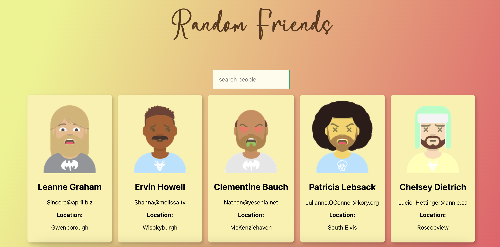

# Plant Friends 🌱

Plant Friends is a simple React application that fetches user data from a placeholder API and displays it alongside randomly generated images. This app is styled using Tachyons, offering a clean, minimalistic design. Currently, random images are generated from [RoboHash](https://robohash.org/), but future updates will include a real plant image API to bring even more life to the application.

## Demo


## Features
- Fetches user data from [JSONPlaceholder](https://jsonplaceholder.typicode.com/users)
- Generates random people images from [RoboHash](https://robohash.org/) for each user
- Styled with [Tachyons](https://tachyons.io/)
- Displays user names, emails, city and profile images

## Getting Started

### Prerequisites
- Node.js (v14+ recommended)
- npm or yarn

### Installation

1. **Clone the repository:**
    ```bash
    git clone https://github.com/yourusername/plant-friends.git
    cd plant-friends
    ```

2. **Install dependencies:**
    ```bash
    npm install
    # or if you're using yarn
    yarn install
    ```

3. **Start the development server:**
    ```bash
    npm start
    # or if you're using yarn
    yarn start
    ```

4. **Open the app:**
   The app should automatically open in your default browser at [http://localhost:3000](http://localhost:3000).

### Build for Production
To create an optimized production build:
```bash
npm run build
# or if you're using yarn
yarn build