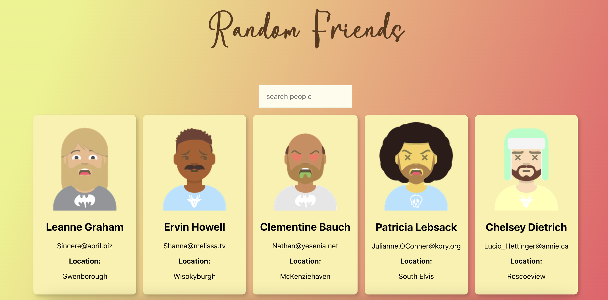

# Plant Friends 🌱

Plant Friends is a simple React application that fetches user data from a placeholder API and displays it alongside randomly generated images. This app is styled using Tachyons, offering a clean, minimalistic design. Currently, random images are generated from [RoboHash](https://robohash.org/), but future updates will include a real plant image API to bring even more life to the application.

Visit the last version of the app [here](https://plant-friends-franciscos-projects-7c1bd475.vercel.app/).

## Demo


## Features
- Fetches user data from [JSONPlaceholder](https://jsonplaceholder.typicode.com/users)
- Generates random people images from [RoboHash](https://robohash.org/) for each user
- Styled with [Tachyons](https://tachyons.io/)
- Displays user names, emails, city and profile images

## Getting Started

### Prerequisites
- Node.js (v14+ recommended)
- npm or yarn

### Installation

1. **Clone the repository:**
    ```bash
    git clone https://github.com/yourusername/plant-friends.git
    cd plant-friends
    ```

2. **Install dependencies:**
    ```bash
    npm install
    # or if you're using yarn
    yarn install
    ```

3. **Start the development server:**
    ```bash
    npm start
    # or if you're using yarn
    yarn start
    ```

4. **Open the app:**
   The app should automatically open in your default browser at [http://localhost:3000](http://localhost:3000).

### Build for Production
To create an optimized production build:
```bash
npm run build
# or if you're using yarn
yarn build
```

## API Integration
This application currently uses [JSONPlaceholder](https://jsonplaceholder.typicode.com/users) to fetch mock user data and displays it with random images from [RoboHash](https://robohash.org/). In the future, we plan to replace RoboHash with a plant image API to align with the "Plant Friends" theme.

## Technologies Used
- React - JavaScript library for building user interfaces
- Tachyons - A functional CSS framework for styling
- JSONPlaceholder - Fake Online REST API for testing
- RoboHash - Generates unique placeholder images

## About React Hooks and Redux
Last version of this app is now on the main branch. There are separate feature branches
i.e. feature/react-hooks-migration and feature/react-redux-migration with changes for the transition to using hooks and redux.

## Contributing
Feel free to open issues or submit pull requests for improvements and suggestions.

## License
This project is licensed under the MIT License. See the LICENSE file for details.